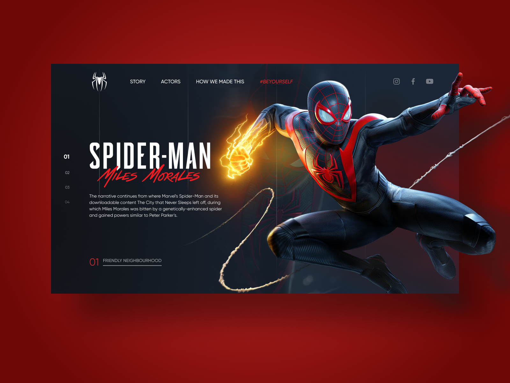

# Spider-man :: Miles Morales

Project developed during **#FrontWeek**.Starting from the creation of UI Design in Figma, development of the entire page structure with HTML, Sass and JS and applying SVG animation concepts and transitions with the GSPAP library.

##Tools used:

   

  
**Credits:** #ProjectNY | <a target="_blank" href="https://www.nyousefali.com.br">Násser Yousef</a>

  
*&copy; Diego Campos*
